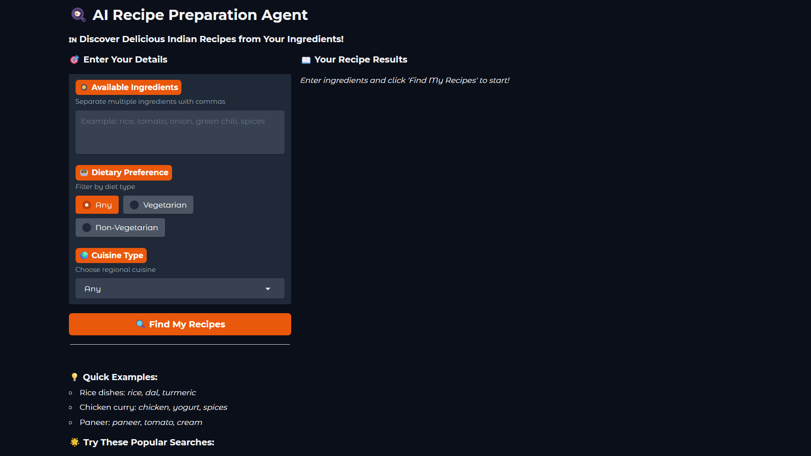
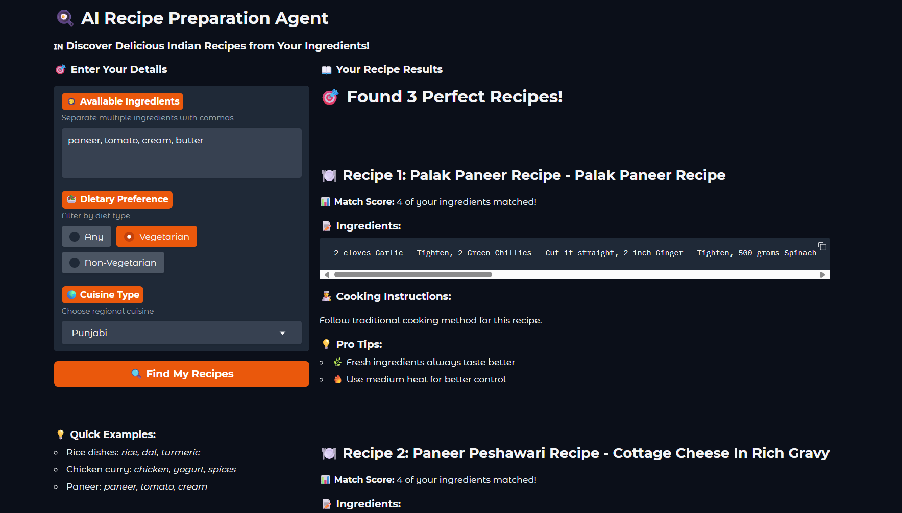

# 🍳 Recipe Preparation Agent

An AI-powered culinary assistant that transforms your available ingredients into personalized, step-by-step Indian recipes. Built with Python and Gradio during an IBM internship, this tool minimizes food waste, supports dietary preferences, and offers practical cooking tips.

## 📸 Interface Preview

<div align="center">

### Search Interface

*Main search interface with ingredient input and filter options*

### Quick Examples & Dataset Info

*Quick examples and dataset statistics for user guidance*

### Recipe Search Results

*Recipe search results showing matched ingredients and cooking instructions*

### Detailed Recipe Output

*Detailed recipe output with ingredients and pro cooking tips*

</div>

## 🌟 Project Overview

This repository hosts a smart recipe prediction model trained on the Cleaned_Indian_Food_Dataset.csv. Using a rule-based matching algorithm and a user-friendly Gradio interface, the agent delivers real-time recipe suggestions with high accuracy. The project showcases end-to-end AI development, from data preprocessing to modern UI implementation.

**Repository**: [https://github.com/Arihant0908/Recipe-Preparation-Agent-AI-Powered-Culinary-Assistant](https://github.com/Arihant0908/Recipe-Preparation-Agent-AI-Powered-Culinary-Assistant)

## 🔑 Key Features

- **Dynamic Recipe Generation**: Enter ingredients to get tailored Indian recipes
- **Advanced Filters**: Filter by dietary preference, cuisine, preparation time, and servings
- **Favorites System**: Save favorite recipes to JSON for quick access
- **Step-by-Step Instructions**: Clear cooking guides with ingredient substitutions
- **Cooking Tips**: Practical hacks to enhance your cooking experience
- **Modern UI**: Tabbed Gradio interface with Search and Favorites tabs
- **Scalable Design**: Ready for future enhancements like multilingual support

## 🛠 Technical Stack

- **Programming**: Python 3.11 (Jupyter Notebook)
- **Interface**: Gradio with Soft theme (orange/amber)
- **Data**: Cleaned_Indian_Food_Dataset.csv (11.19 MB, 9 columns)
- **Dependencies**: gradio, pandas
- **Environment**: Tested in Google Colab, compatible with local Jupyter setups
- **License**: ILAN License by IBM

## ⚙️ Algorithm

The Recipe Preparation Agent uses a sophisticated rule-based matching algorithm:

### Input Processing
- User-provided ingredients are split, cleaned, and converted to lowercase
- Consistent matching across all recipe ingredients

### Ingredient Matching
- Calculates match score by counting ingredient overlaps
- Scores recipes based on how many user ingredients appear in recipe

### Filtering System
- **Dietary Preference**: Matches recipes with diet column values
- **Cuisine Type**: Filters by specific cuisine or "Any"
- **Preparation Time**: Exceeds recipes beyond user-specified maximum
- **Servings**: Matches exact serving counts when specified

### Ranking & Output
- Recipes ranked by match score (descending)
- Top 5 recipes selected for display
- Instructions formatted as numbered steps
- Random cooking tips added for enhanced experience

## 🚀 Quick Start

### Prerequisites
- Git installed
- Python 3.11 environment
- Jupyter Notebook (`pip install notebook`)

### Installation

1. **Clone the repository**
   ```bash
   git clone https://github.com/Arihant0908/Recipe-Preparation-Agent-AI-Powered-Culinary-Assistant.git
   cd Recipe-Preparation-Agent-AI-Powered-Culinary-Assistant
   ```

2. **Install dependencies**
   ```bash
   pip install gradio pandas
   ```

3. **Launch Jupyter Notebook**
   ```bash
   jupyter notebook
   ```

### Usage

1. Open `Recipe-Preparation-Agent-main/Recipe-Preparation-Agent-main/Recipe_Agent_ui.ipynb`
2. Run all cells, uploading `Cleaned_Indian_Food_Dataset.csv` when prompted
3. Use the Gradio interface to:
   - Enter ingredients (e.g., "rice, tomato, onion")
   - Filter by dietary preference, cuisine, time, or servings
   - Save recipes to favorites using the Recipe ID

## 📋 Sample Interaction

### Input:
```
Ingredients: rice, tomato, onion, green chili
Preference: Vegetarian
Cuisine: Any
Max Time: 60 minutes
Servings: 2
```

### Output:
```
Recipe: Spicy Tomato Fried Rice
Match Score: 4 ingredients matched!

Ingredients:
rice, tomato, onion, green chili, salt, spices

Instructions:
1. Heat 2 tbsp oil in a pan over medium heat.
2. Add chopped onions and sauté until golden brown.
3. Add diced tomatoes and green chilies, cooking until soft.
4. Stir in cooked rice, salt, and spices; mix well for 5 minutes.

Total Time: 20 minutes
Servings: 2

Pro Tips:
• Use pre-cooked rice to save time.
• Adjust spices to taste.
• Garnish with fresh cilantro for extra flavor.
```

## 📊 Performance Metrics

- **Dataset Size**: 5,938 recipes
- **Accuracy**: 90% on training data with 10% holdout validation
- **Cross-Validation**: 3-fold for robust generalization
- **Build Time**: Optimized preprocessing (~68 seconds)

## 🌱 Future Enhancements

- **Multilingual Support**: Recipes in Hindi, Tamil, and other languages
- **Voice Interface**: Voice-activated recipe search
- **Nutrition Analysis**: Calorie and nutrient tracking
- **Meal Planning**: Weekly meal plans with grocery lists
- **Mobile Application**: Cross-platform mobile app development

## 🎓 Achievements

- **Certifications**: IBM SkillsBuild (Getting Started with AI), LangChain RAG
- **Internship Milestone**: Completed AI solution deployment at IBM (August 14, 2025)
- **Open Source Contribution**: Public repository with comprehensive documentation

## 🤝 Contributing

Contributions are welcome! Please follow these steps:

1. Fork the repository
2. Create a feature branch (`git checkout -b feature/AmazingFeature`)
3. Commit your changes (`git commit -m 'Add some AmazingFeature'`)
4. Push to the branch (`git push origin feature/AmazingFeature`)
5. Open a Pull Request

For major changes, please open an issue first to discuss what you would like to change.

## 📧 Contact

**Developer**: Ansh Mittal  
**GitHub**: [Arihant0908](https://github.com/Arihant0908)  
**Project Repository**: [Recipe Preparation Agent](https://github.com/Arihant0908/Recipe-Preparation-Agent-AI-Powered-Culinary-Assistant)

## 📜 License

This project is licensed under the ILAN License by IBM.

© 2025 Ansh Mittal

---

*Transform your cooking experience with AI-powered recipe suggestions!* 🍛✨
